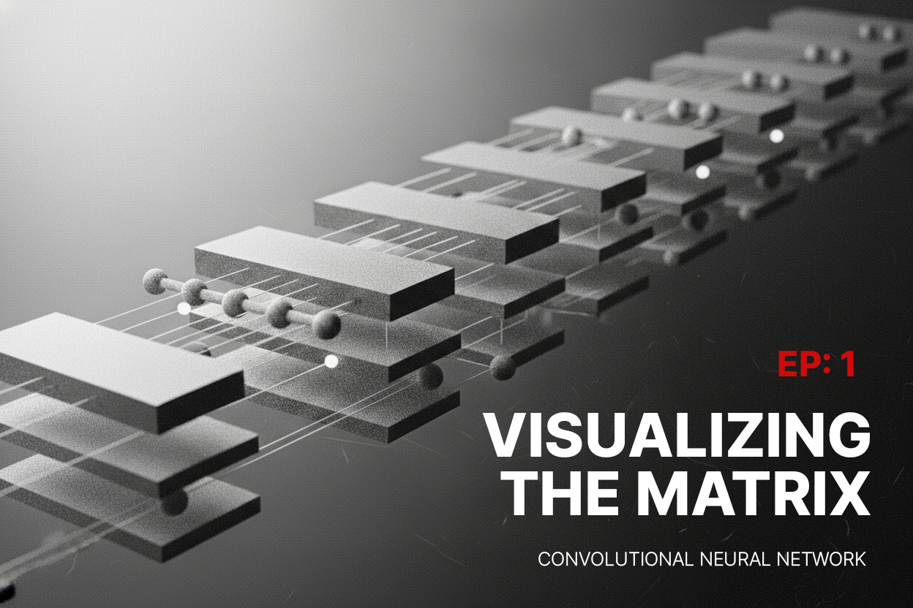
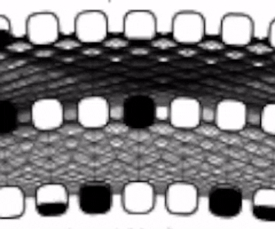

 
<br>
<hr>

## 개인 프로젝트

지금 보시는 화면은 제가 군복무를 하면서 만들었던 인공 신경망 시각화 프로젝트인데요. 프로젝트를 진행하면서 했던 고민과 철학, 겪었던 내용들을 맥락과 함께 자세하게 이야기 해보고자 합니다. 다소 긴 호흡으로 진행될 예정이니 구조와 동작원리만을 설명하는 글은 여기에서 참고하실 수 있습니다.


어떤 일을 함에 있어 본인이 무엇을 하는지 아는 것은 중요합니다. 이를 알기 위해서는 '왜' 라는 근본적인 질문을 던져보아야 합니다.

#### 그래서 왜 만들었나?
소프트웨어 개발에 관한 글을 쓰고 있지만, 저는 개발자가 아닙니다. 뜬금없이 무슨 말인지 모르시겠다구요? 괜찮습니다. 저를 개인적으로 아시거나 오랫동안 봐왔던 분이라면 더욱 의문일 것이라고 생각합니다만, 해당 본문에서는 이 말의 의미를 천천히 풀어 나가보겠습니다.

여러분들은 '사람은 어떻게 사고하는가' 라는 생각을 해보신 적 있나요? 저에게 있어 이 질문은 중요했습니다.
어떤 원리로 사고가 이루어지는지 아는 것은, 곧 어떻게 생각해야 하는가 와도 맞닿아 있는 질문이기 때문입니다.
인간의 사고 과정은 곧 행동의 본질이고, 이와 같은 맥락으로 '생각하는 행위' 에 대한 호기심은 '기계는 어떻게 생각하는가'에 대한 내용으로 자연스레 확장되었습니다.

#### 개발을 접하다
다소 어려운 이야기를 해보았으니 저에 대한 내용도 잠시 언급해보겠습니다. 저는 2022년도 대학교에 입학하며 SSU-IT LOCKER[^1] 프로젝트를 통해 소프트웨어 개발을 처음으로 본격적으로 접하게 되었습니다. 그 이전까지는 디자인과 영상 편집 등을 해오며 무언가를 만드는 것에 흥미를 느끼곤 하였는데요. ('사람들의 생각과 감정을 바꿀 수 있는' 이라는 슬로건도 이때 나오게 되었습니다)

본격적인 대학 생활을 시작하며 학생자치회와 회장단, 동아리 및 외부 활동과 팀 프로젝트, 랩실, 개발팀 리드에 이르기까지 다양한 활동들을 맡고 경험하게 되었습니다. 그러나 역설적이게도 이러한 경험은 개발에 대한 깊은 이해나 성장보다는 팀과 조직 문화, 리딩과 기획 차원에서의 성장과 도메인 확장을 가져왔습니다.

바닐라 자바스크립트가 아닌 프레임워크부터 접하며 개발을 시작하게 된 저로서는 기본기 부족에 대한 근본적인 갈증이 남아있었고, 문득 제로투원으로 직접 구상하여 개발하고 배포해본 소프트웨어가 없다는 사실을 깨달았습니다.

## 무엇을 어떻게 만들어야 할까 
#### Study보단 Learn
저는 개인적으로 공부라는 말 대신 학습이라는 표현을 좋아합니다. 홍대병 아닙니다 이는 내적 동기가 그 어떤 외부적 동기보다 강하기 때문인데요. "실력을 키우려면 본인이 진정으로 원하는 것을 만들어보라"는 말도 같은 이유 때문에 나왔으리라 생각합니다. 무언가를 만든다는 것은 능동적인 행위인 만큼 문제의 본질을 명확하게 정의하고, 단순히 구현하는 것을 넘어 아키텍처에 대한 깊은 고민과 엔지니어링 프렉티스를 추구하고자 하였습니다.

요즘 시대에 AI를 아는 사람은 많지만, 근본적인 동작 원리를 아는 사람은 많이 없으리라 생각합니다. 저 또한 AI에 도움을 받고 있지만 세부적인 동작 원리까지는 알지 못하였는데요. 이 기회에 이를 직접 구현해보고 직관적으로 알아볼 수 있게 시각화 해보는 것은 어떨까? 라는 생각을 하게 되었습니다.

**그렇게 성장에 대한 염원과 지적 호기심을 담은 인공지능 시각화 프로젝트가 시작되었습니다.**

## 디자인과 철학
저는 UI를 설계할 때 심미적인 아름다움과 이유 있는 설계 사이에 균형을 추구합니다. 이는 단순히 이쁘거나 실용적이기만 한 것이 아닌, 큰 노력 없이도 직관적으로 사용할 수 있는 '좋은 디자인'을 의미합니다. UX에 있어 직관성이 중요한 이유는.. 다들 한번 쯤 겪어보셨으리라 생각합니다.


이는 곧 유저의 사용성으로 이어지기 때문인데요. 이 밖에도 `queryProcessController.ts` 직관의 기준이 될만한 경우는 다음과 같은 내용이 있을 것 같습니다.

>  이미 많은 사용자들로부터 사용되고 있거나 과거부터 사용 되어온 기표의 경우(사회적으로 학습된 직관)
> 특정한 동작이 어떤 행위에 물리적 행동과 유사한 경우(물리적으로 학습된 직관)

> test

`backquote`

```ts
export const formatDateTime = (date: Date | string) => {
  const d = typeof date === "string" ? new Date(date) : date;

  const datePart = new Intl.DateTimeFormat("ko-KR", {
    year: "numeric",
    month: "2-digit",
    day: "2-digit",
  }).format(d);

  const timePart = new Intl.DateTimeFormat("en-US", {
    hour: "numeric",
    minute: "2-digit",
    hour12: true,
  }).format(d);

  return `${datePart.replace(/\s/g, "").replace(/\.$/, "")} / ${timePart}`;
};
```
#### 기술과 예술, 그리고 인터렉션
그러나 문제가 있습니다. `test`  인공지능을 어떻게 직관적으로 표현할 수 있을까요? 이를 대답하기 위해 '인공신경망'에 대한 개념을 잠시 언급 하겠습니다.(세부적인 원리에 대해서는 추후 이야기해보기로 하고, 우선 UX/UI라는 맥락 안에서 다뤄봅시다)

 

이렇게 생긴 친구가 인공신경망 입니다. ~~복잡해 보인다고 겁먹으실 거 없습니다!~~
정확히는 Convolution Neural Network(합성곱 신경망) 이라고 하는데요. NNV 프로젝트에서도 이 CNN이 사용되었습니다. 이는 AI에 있어 가장 기본적인 네트워크 아키텍처 형태로 1943년 Warren McCulloch과 Walter Pitts에 의해 처음 제안 되었습니다. - 사람으로 치면 뇌 구조라고 생각하시면 됩니다.

```ts
export const formatDateTime = (date: Date | string) => {
  const d = typeof date === "string" ? new Date(date) : date;

  const datePart = new Intl.DateTimeFormat("ko-KR", {
    year: "numeric",
    month: "2-digit",
    day: "2-digit",
  }).format(d);

  const timePart = new Intl.DateTimeFormat("en-US", {
    hour: "numeric",
    minute: "2-digit",
    hour12: true,
  }).format(d);

  return `${datePart.replace(/\s/g, "").replace(/\.$/, "")} / ${timePart}`;
};
```

사람의 두뇌 뉴런 구조를 모방한 인공 신경망은 노드와 간선로 구성되어 있으며, 입력 신호를 행렬 연산을 통해 계산하여 출력을 하게 됩니다. 이를 퍼셉트론이라고 부르기도 합니다. 사실 지적 능력을 갖춰 보이는 인공지능은 간단하게 말해 노드의 입력을 내부 계산을 통해 값을 도출하는 분류기에 불과한 것 이였습니다.

노드와 간선이라.. 그림으로 그리기 딱 좋아 보이네요.
그렇다면, 퍼셉트론의 상호작용을 인터렉티브하게 표현한다면 AI의 사고 과정을 직관적으로 볼 수 있지 않을까요?

이런 식으로 말이죠.



와! 인공지능의 기초적인 내용에 대해 배워가며 퍼셉트론을 직접 구현해본다면 예술적으로도, 기술적으로도 만들어볼 가치가 있겠다는 생각이 들었습니다.

좋습니다. 인공신경망을 어떻게 시각화 해야 할지 알겠으니 이제 UI로 녹여봐야겠죠?
다음 에피소드에서는 디자인과 UX 설계에 대한 고민을 해보겠습니다.

[^1]: SSU-ITLOCKER는 숭실대학교에서 사용하는 교내 사물함 시스템입니다. 소중한 친구인 @EATSTEAKE와 함께 기획/개발 하였습니다.
[^2]: 이미지 출처: http://computing.or.kr/14569/deep-learning%EB%94%A5%EB%9F%AC%EB%8B%9D/